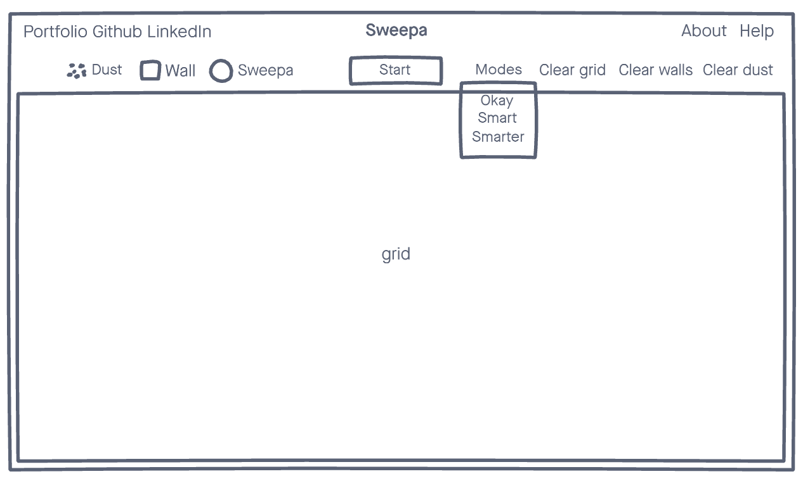

# Sweepa

Sweepa is a robot vacuum that uses algorithms X and Y to clean your floor and improve its path. You can draw your room's layout, place Sweepa anywhere in the room and watch it clean with different settings. 

# MVPs

Users are able to: 
* Draw walls on a grid and place Sweepa down
* Start Sweepa's cleaning routine
* Change Sweepa's cleaning mode & speed

Bonus:
* Make spaces extra dirty for Sweepa to clean or add furniture

# Wireframes

# Technologies

* JavaScript
* HTML
* SCSS

# Timeline
* Setup grid with wall placement/clearing functionality and styling (1 day)
* Sweepa cleaning functionality and styling (2 days)
* Sweepa's alternate cleaning modes (1 day)
